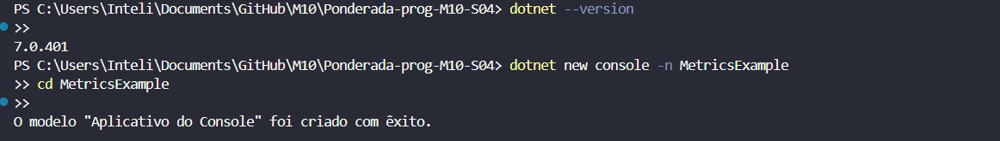
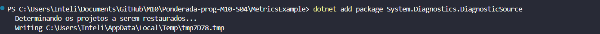
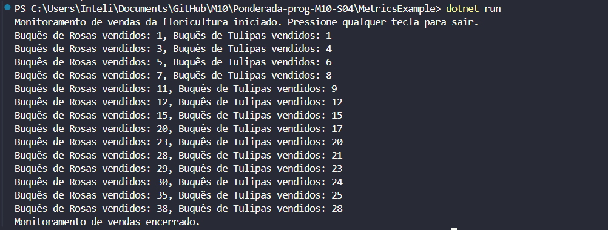

# Criando Métricas com .NET

## Introdução

Métricas desempenham um papel essencial na garantia da qualidade de software, fornecendo informações quantitativas sobre o desempenho e comportamento de um sistema. Essas informações auxiliam na identificação de melhorias, no monitoramento contínuo e na validação de expectativas dos usuários. No contexto de uma floricultura, métricas podem ser usadas para monitorar as vendas em tempo real, permitindo que o negócio tome decisões rápidas e otimizadas.

Neste projeto, implementamos métricas que monitoram a quantidade de buquês de rosas e tulipas vendidos. Essas informações podem ajudar a floricultura a identificar padrões de vendas, gerenciar estoques e compreender as preferências dos clientes.

## 1. Configuração do Ambiente

Pré-requisitos
- Ter o SDK do .NET instalado.
- Após a instalação, verificar a versão instalada para garantir que tudo está funcionando corretamente:

```bash
dotnet --version
```

### Criação do Projeto

No terminal ou prompt de comando criamos um novo projeto:

```bash
dotnet new console -n MetricsExample
cd MetricsExample
```



Obs: O .Net estava desatualizado, tive que baixar a versão 8.0.0 para executar o projeto.

### Adicionando pacote necessário para trabalhar com as métricas:

```bash
dotnet add package System.Diagnostics.DiagnosticSource
```


## 2. Configuração do Arquivo Program.cs

No arquivo Program.cs, foi implementado a lógica para monitorar as vendas de buquês de flores. O código a seguir simula a venda de rosas e tulipas a cada segundo e exibe o total de vendas no console.

```C#
using System.Diagnostics.Metrics;

class Program
{
    // Criando o medidor para monitorar vendas na floricultura
    static Meter s_meter = new Meter("Floricultura.Vendas");

    // Contadores para os tipos de buquês vendidos
    static Counter<int> s_rosesSold = s_meter.CreateCounter<int>("floricultura.vendas.rosas_vendidas");
    static Counter<int> s_tulipsSold = s_meter.CreateCounter<int>("floricultura.vendas.tulipas_vendidas");

    static void Main(string[] args)
    {
        int totalRosesSold = 0;  // Total de buquês de rosas vendidos
        int totalTulipsSold = 0; // Total de buquês de tulipas vendidos

        Console.WriteLine("Monitoramento de vendas da floricultura iniciado. Pressione qualquer tecla para sair.");

        Random random = new Random();

        // Simulação de vendas
        while (!Console.KeyAvailable)
        {
            Thread.Sleep(1000);

            // Simulando a venda de buquês de rosas
            int rosesSold = random.Next(1, 6); // Vende de 1 a 5 buquês de rosas
            s_rosesSold.Add(rosesSold);
            totalRosesSold += rosesSold;

            // Simulando a venda de buquês de tulipas
            int tulipsSold = random.Next(1, 4); // Vende de 1 a 3 buquês de tulipas
            s_tulipsSold.Add(tulipsSold);
            totalTulipsSold += tulipsSold;

            Console.WriteLine($"Buquês de Rosas vendidos: {totalRosesSold}, Buquês de Tulipas vendidos: {totalTulipsSold}");
        }

        Console.WriteLine("Monitoramento de vendas encerrado.");
    }
}
```


## 3. Execução do e Monitoramento do Programa

### Compilando o projeto para verificar se não há erros:

```bash
dotnet build
``` 

### Executandi o programa para iniciar o monitoramento das vendas:

```bash
dotnet run
``` 



## 5. Conclusão
A implementação de métricas na aplicação da floricultura demonstrou como é possível monitorar eventos significativos em tempo real. O contador de buquês vendidos permite visualizar o desempenho de vendas, identificar padrões e tomar decisões informadas para o negócio.

Esse tipo de monitoramento pode ser expandido para incluir novos tipos de flores, análise de receita e integração com sistemas de relatório. Assim, o uso de métricas não apenas melhora a qualidade do software, mas também auxilia na gestão eficiente de recursos e na maximização de resultados.